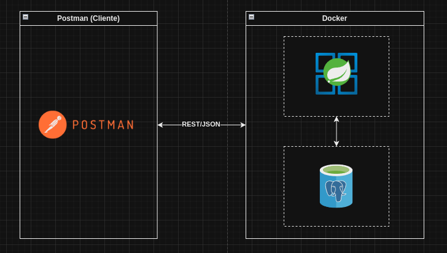

# 🚀 Proyecto de Registro con Spring Boot y PostgreSQL

Este proyecto es un ejemplo de una aplicación Spring Boot que utiliza una base de datos PostgreSQL, todo orquestado con Docker Compose.

## ✅ Prerrequisitos

- 🐋 **Docker**: Asegúrate de tener Docker instalado en tu máquina.
- 📦 **Docker Compose**: Verifica que Docker Compose esté disponible.

## 🗂️ Estructura del Proyecto

El proyecto consta de dos servicios principales:

1. **🐘 postgres-db**: Este servicio corre una instancia de PostgreSQL.
2. **🌱 springboot-app**: Este servicio ejecuta la aplicación Spring Boot que se conecta a la base de datos PostgreSQL.



## 🏗️ Arquitectura

Este proyecto es una aplicación basada en el patrón MVC (Model-View-Controller), organizada en varias capas clave:

- **📊 Model**: Representado por las clases `User` y `Phone`, que definen la estructura de los datos y gestionan la lógica relacionada con ellos. Los repositorios como `UserRepository` y `PhoneRepository` se encargan de la comunicación con la base de datos.

- **👁️ View**: Aunque no hay una vista tradicional en una API, las respuestas a las solicitudes están formateadas y gestionadas por los controladores y DTOs (`UserDTO`, `PhoneDTO`, etc.), que estructuran los datos antes de enviarlos al cliente.

- **🛠️ Controller**: Los controladores como `AuthController` y `UserController` manejan las solicitudes HTTP, interactúan con los servicios (`UserService`, `ValidationService`), y devuelven las respuestas adecuadas. También se incluyen manejadores de excepciones como `GlobalExceptionHandler` para gestionar errores de manera centralizada.

El proyecto está configurado con varias clases de configuración (`SecurityConfig`, `SwaggerConfig`), y maneja la seguridad mediante JWTs, con un filtro de seguridad (`JwtRequestFilter`) y utilidades (`JwtUtil`).

## 🧱 Arquitectura del Proyecto

Este proyecto sigue el patrón de arquitectura **MVC (Model-View-Controller)**, dividido en varias capas bien definidas:

- **📊 Model**: Esta capa contiene las clases que representan las entidades del dominio, como `User` y `Phone`. Estos modelos gestionan la lógica relacionada con los datos y su persistencia. Los repositorios, como `UserRepository` y `PhoneRepository`, son responsables de la interacción directa con la base de datos.

- **👁️ View**: Aunque en esta API REST no se maneja una vista tradicional, la capa View está representada por los **DTOs (Data Transfer Objects)**, como `UserDTO`, `PhoneDTO`, y `UserResponse`, que estructuran y formatean los datos antes de enviarlos como respuestas a los clientes.

- **🛠️ Controller**: Los controladores (`AuthController`, `UserController`, `GlobalExceptionHandler`) gestionan las solicitudes HTTP entrantes. Se encargan de la lógica de negocio a través de servicios como `UserService` y `ValidationService`, y devuelven las respuestas procesadas al cliente. Además, `GlobalExceptionHandler` se utiliza para el manejo centralizado de excepciones.

- **🔧 Service**: Los servicios como `UserService` y `ValidationService` encapsulan la lógica de negocio. Aquí es donde se implementa la funcionalidad principal del sistema, separando la lógica de los controladores.

- **🔒 Security**: La seguridad se implementa utilizando JWTs. La configuración y validación de los tokens se gestiona mediante `JwtUtil` y `JwtRequestFilter`, proporcionando una capa de seguridad para proteger los endpoints de la API.

- **⚙️ Configuración**: El proyecto está configurado mediante clases como `SecurityConfig`, `SwaggerConfig`, y `MessageSourceConfig`, que definen la configuración de seguridad, documentación de la API y manejo de mensajes internacionales.

En conjunto, esta arquitectura modularizada facilita la escalabilidad, mantenibilidad y reutilización de componentes dentro del proyecto.

## ⚙️ Configuración de los Servicios

### 🐘 PostgreSQL (`postgres-db`)

- **Imagen**: `postgres:15`
- **Nombre del contenedor**: `postgres_db`
- **Variables de entorno**:
  - `POSTGRES_USER`: Nombre de usuario para la base de datos (por defecto `user`).
  - `POSTGRES_PASSWORD`: Contraseña para el usuario de la base de datos (por defecto `user`).
  - `POSTGRES_DB`: Nombre de la base de datos (por defecto `userP_test`).
- **Puertos**: El puerto `5432` de PostgreSQL está mapeado al puerto `5432` en la máquina host.
- **Volúmenes**: Los datos de PostgreSQL se persisten en un volumen Docker (`postgres_data`).

### 🌱 Spring Boot (`springboot-app`)

- **Imagen**: `register-springboot-app`
- **Nombre del contenedor**: `register-springboot_app`
- **Dependencias**: Este servicio depende del servicio `postgres-db`, por lo que se iniciará después de que `postgres-db` esté listo.
- **Variables de entorno**:
  - `SPRING_DATASOURCE_URL`: URL de conexión a la base de datos (por defecto `jdbc:postgresql://postgres-db:5432/userP_test`).
  - `SPRING_DATASOURCE_USERNAME`: Nombre de usuario para la conexión a la base de datos (por defecto `user`).
  - `SPRING_DATASOURCE_PASSWORD`: Contraseña para la conexión a la base de datos (por defecto `user`).
- **Puertos**: El puerto `8080` de la aplicación está mapeado al puerto `8080` en la máquina host.

## 🛠️ Instrucciones para Ejecutar el Proyecto

1. 🧑‍💻 Clona este repositorio en tu máquina local.
2. 📂 Navega hasta el directorio donde se encuentra el archivo `docker-compose.yml`.
3. 🏃 Ejecuta el siguiente comando para iniciar los servicios:

   ```bash
   docker-compose up --build

## 📡 Pruebas de Endpoints

La aplicación expone varios endpoints para interactuar con el sistema de registro y autenticación. A continuación, se describe cómo probar cada uno de ellos.

### 1. ✍️ `/api/register`

Este endpoint permite a los usuarios registrarse en la aplicación.

- **Método**: `POST`
- **URL**: `http://localhost:8080/api/register`
- **Cuerpo de la solicitud (JSON)**:
  ```json
  {
    "name": "nelson",
    "email": "d@gmail.com",
    "password": "hunter2",
    "phones": [
        {
            "number": "12345",
            "citycode": "1",
            "contrycode": "57"
        }
     ]
  }


### 2. 🔑 `/api/login`

Este endpoint permite a los usuarios autenticarse en la aplicación.

- **Método**: `POST`
- **URL**: `http://localhost:8080/api/login`
- **Cuerpo de la solicitud (JSON)**:
  ```json
  {
    "email": "user@example.com",
    "password": "password123"
  }

### 3. 📊 `/api/dashboard`

Este endpoint permite a los usuarios ingresar a la api con jwt.

- **Método**: `GET`
- **URL**: `http://localhost:8080/api/dashboard`
- **Encabezado de Autorización**:
    - **Clave**:`Authorization`
    - **Valor**: `Bearer <token_obtenido_del_login>`

## 📝 Swagger
URL: `http://localhost:8080/swagger-ui.html`
